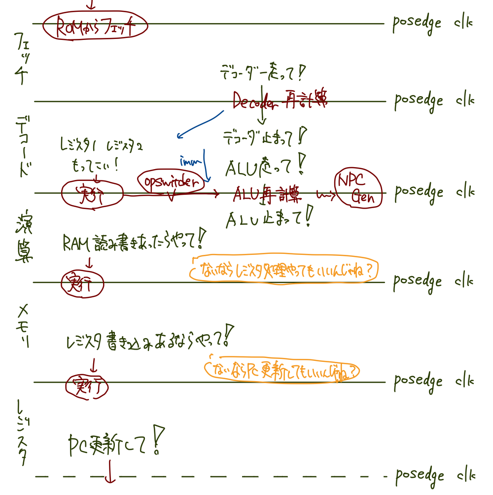

# 後期実験「マイクロプロセッサの設計と実装」
## アーキテクチャ
### バージョン3.1.1: 
#### 更新内容
- ALU, NPC計算の並列化によるEXステージクリティカルパス改善
- クロックのDuty Cycleを5:5 -> 4:6に変更し、negedgeを長くすることで、RAM書き込みに十分な時間を確保
#### パフォーマンス
90MHzでのコンパイル・シミュレーションに成功。CoreMarkスコア105。
```
2K performance run parameters for coremark.
CoreMark Size    : 666
Total ticks      : 1716798772
Total time (secs): 19
Iterations/Sec   : 105
Iterations       : 2000
Compiler version : GCC13.2.0
Compiler flags   : 
Memory location  : STACK
seedcrc          : 0xe9f5
[0]crclist       : 0xe714
[0]crcmatrix     : 0x1fd7
[0]crcstate      : 0x8e3a
[0]crcfinal      : 0x4983
Correct operation validated. See readme.txt for run and reporting rules.
```
### バージョン3.1: BTB+PHT付き5サイクル・パイプライン
#### 更新内容
- 分岐予測にPattern History Tableを実装。サイズ256の2ビットカウンタ予測器
#### パフォーマンス
70MHzで動作すると仮定したときのシミュレーション結果。
```
2K performance run parameters for coremark.
CoreMark Size    : 666
Total ticks      : 944239053
Total time (secs): 13
Iterations/Sec   : 84
Iterations       : 1100
Compiler version : GCC13.2.0
Compiler flags   : 
Memory location  : STACK
seedcrc          : 0xe9f5
[0]crclist       : 0xe714
[0]crcmatrix     : 0x1fd7
[0]crcstate      : 0x8e3a
[0]crcfinal      : 0x33ff
Correct operation validated. See readme.txt for run and reporting rules.
```

## 歴代アーキテクチャ
### バージョン3.0: 分岐予測付き5サイクル・パイプライン
#### 更新内容
- 簡易なBranch Target Bufferを実装。PCの上6bitをtag, 下10-2=8bitをindexとするキャッシュを作成し、ヒットしたらNPCに採用
#### パフォーマンス
70MHzで動作すると仮定したときのシミュレーション結果。
```
2K performance run parameters for coremark.
CoreMark Size    : 666
Total ticks      : 991732333
Total time (secs): 14
Iterations/Sec   : 78
Iterations       : 1100
Compiler version : GCC13.2.0
Compiler flags   : 
Memory location  : STACK
seedcrc          : 0xe9f5
[0]crclist       : 0xe714
[0]crcmatrix     : 0x1fd7
[0]crcstate      : 0x8e3a
[0]crcfinal      : 0x33ff
Correct operation validated. See readme.txt for run and reporting rules.
```

### バージョン2.2: 5サイクル・パイプライン
#### 更新内容
- EX　→　EX + MA　に変更
- Loadした値をEXで使用するときは1クロックストールさせる
#### パフォーマンス
70MHzでのコンパイル結果

70MHzでの実行結果
```
2K performance run parameters for coremark.
CoreMark Size    : 666
Total ticks      : 1150616879
Total time (secs): 16
Iterations/Sec   : 68
Iterations       : 1100
Compiler version : GCC13.2.0
Compiler flags   : 
Memory location  : STACK
seedcrc          : 0xe9f5
[0]crclist       : 0xe714
[0]crcmatrix     : 0x1fd7
[0]crcstate      : 0x8e3a
[0]crcfinal      : 0x33ff
Correct operation validated. See readme.txt for run and reporting rules.
```

### バージョン2.1
分散RAM→Block RAM

### バージョン2: 4サイクル・パイプライン
#### パイプラインステージ
- IFステージ: PCを代入し(posedge)、ROMから命令を読み込む(negedge)
- IDステージ: 命令をデコードし、レジスタからオペランドを読み込む
- EXステージ: ALUで演算を行い(posedge)、メモリ読み書きがあれば実行する(negedge)
- WBステージ: レジスタに結果を書き込む
#### 工夫
- デフォルトでPC<=PC+4で計算する(常に分岐しないと予測する)ことで、デコード待ちのストールが不要
- フォワーディングを行うことで、EXステージでのレジスタ書き込み待ちのストールが不要

#### パフォーマンス
~~100MHzで35MHzで動作？~~ →もっと小さい。10MHzくらい？
とりあえず5MHz。
```
// Simulation Result(35MHz)
// TODO: FPGAで実行し、置換
2K performance run parameters for coremark.
CoreMark Size    : 666
Total ticks      : 615447789
Total time (secs): 17
Iterations/Sec   : 35
Iterations       : 600
Compiler version : GCC13.2.0
Compiler flags   : 
Memory location  : STACK
seedcrc          : 0xe9f5
[0]crclist       : 0xe714
[0]crcmatrix     : 0x1fd7
[0]crcstate      : 0x8e3a
[0]crcfinal      : 0xbd59
Correct operation validated. See readme.txt for run and reporting rules.
```

### バージョン1: 5サイクル・非パイプライン

### パフォーマンス
```
2K performance run parameters for coremark.
CoreMark Size    : 666
Total ticks      : 1100031610
Total time (secs): 13
Iterations/Sec   : 23
Iterations       : 300
Compiler version : GCC13.2.0
Compiler flags   : 
Memory location  : STACK
seedcrc          : 0xe9f5
[0]crclist       : 0xe714
[0]crcmatrix     : 0x1fd7
[0]crcstate      : 0x8e3a
[0]crcfinal      : 0x5275
Correct operation validated. See readme.txt for run and reporting rules.

```